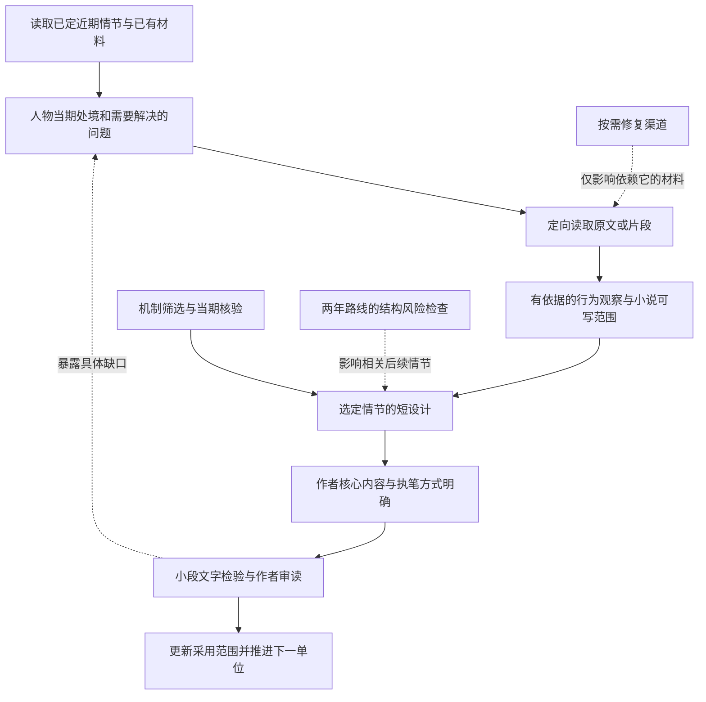

# 逐梦之旅 项目总览与推进事项

更新：2026-10-08。**宏观路线与系统、人物基线已经形成，资料积累较多但不均；正式正文和叙事声音仍未获得完整认可。** 全仓整合已通过PR #15合入main（7125c7d）。人物附件与后续依赖已有对照；本聊天新增中单竞技价值方法及蓝猫、TA、龙骑士试点，宏观收益仍为I/H，没有恢复具体交锋或正文。本页维护整体状态、工作范围与统一待办；完整内容按维度读取，不再串读历次增量。

## 1 项目现在是什么

小说从TI10失利后的陈越/Loop起步，位置为二号位，经训练、天梯与直播圈、Aries、国际赛走向重新组队争冠。主要赛果和阵容方向已经选择到2023年TI12；这些是小说世界线，不是现实赛果。系统提高训练与研究效率，实战完全退出；主角可以快速成长，队友和对手仍有自己的能力与选择。

以上只是方向摘要，详细取值在下表对应文件维护。已定、工作方案、未定不能互相代替；Git提交或合并也不等于作者采用正文或完成游戏验证。main是已合入基线；后续方案调整仍通过独立研究分支交付，合并授权按具体请求执行。

## 2 当前内容分在哪里

| 维度与唯一维护页 | 完整保存什么 | 当前成熟度与缺口 |
|---|---|---|
| [设定与系统](06_story/current-setting.md) | 小说目标、身份/生活、初始水平、评分、系统能力与成长边界 | 基线可用；学校名称、家庭细节、具体数字等部分为工作值，不必一次锁死 |
| [人物与关系](06_story/character-writing-cards.md) | 主角语言行为、真人分期写法、关系阶段及当期材料缺口 | 开篇至2022春有卡；Zhou/ZSMJ/Aries声音不齐，2023成员准备不均 |
| [剧情与正文状态](06_story/current-plot.md) | 两年路线、工作因果链、近期英雄、21份正文的采用范围和承接关系 | 大结果较清楚；资格连锁、两次重组的具体戏和若干衔接仍待落实 |
| [写作与研究方法](06_story/narrative-writing-rules.md) | 叙事、解释、人物差异、中文表达、共同创作/编辑、查证与收口方法 | 规则已整合；不能替代实际好看的文本，尚无作者认可的风格标杆 |
| [事实资料现状](00_meta/research-status.md) | 版本、赛事、队伍、真人、经典对局、生态、来源与工具的覆盖和证据限制 | 各域资料深浅不同；有索引、数据或来源不等于场景已核完 |
| [中单技巧总库](09_training/technique-catalog.md) | 技巧、用途、证据、版本、争议与缺口；竞技价值方法与三英雄宏观试点 | 39英雄有操作材料、29未达同等深度；宏观试点不增加技巧数量；128旧编号与8候选有重复/分支，未全量实测 |

通常先读本页，再读当前任务涉及的一至两个维度。写作必须另读实际承接的正文和必要同期来源；复用已核结论不等于重新观看视频。需要原因或证据时再查[分类目录](00_meta/archive-index.md)、[作者决策审计](06_story/locked-decisions.md)和原卡。

## 3 整体情况与主要风险

- **创作成果：** 21份正文/试写资产已列清；旧开篇有撤回或文风不认可，Zhou流程认可不等于文字定稿，其他连续稿多为X探索。正式连续正文没有因为文件写到春季就自动成立。
- **资料成果：** 经典库有3329局索引、62组系列、171局详细第三方数据；这批对局未完成录像观看。TI10第五局另有以前实际完成的官方Replay提取，不能一概称全项目从未解析。细节见资料现状。
- **情节风险：** 两次重组已有工作因果，但冠军队为何仍调整、旧队友怎样选择还需具体呈现；修改成绩后的DPC积分、预选席位与名单登记尚未全部闭合。
- **人物风险：** 已有Ame等历史档案不等于Zhou日常、Aries队内和2023全员声音都准备好了；本地手册v2和渠道清单已读并完成方法对照，尚未从中导入真人结论。渠道会话记录了浏览器连接受阻，这只说明该读取路径受阻，不说明人物无材料或所有研究都必须等待。
- **研究风险：** 技巧多寡不等于高光质量，单招不必撑整局；不能为填总库无限采集，也不能把后来的机制或人物形象前移。

## 4 待处理事项与推进顺序

### 4.1 先解决什么

小说需要读者愿意继续读、人物不能随意互换、重要选择有可理解的原因。资料的价值是帮助做到这些，而不是把渠道和档案做全。当前最缺的是“材料怎样改变人物写法”的实际结果，以及作者愿意采用的叙事声音；继续扩大来源清单不能单独解决这两个问题。

**建议下一单位为Zhou与Loop从同局合作到愿意再约的最小人物资料试点。** 沿D31既有方向，不新增一场成名赛，也不先设计逐秒交锋。先复用现有卡和同期背景，再查不熟悉队友间的开场、意见分歧、合作后交流，交付有出处的行为观察、关系距离和未知。ZSMJ只在材料中实际参与或下一单位需要时一起做，不硬凑全员档案。

这项建议尚未替代渠道会话中作者此前“先测试渠道、暂缓整体人物研究”的安排。本轮完成合并、附件对照和顺序分析，没有向另一聊天派任务、重试登录、启动人物外部实采或重开正文。下面说明推荐的依赖关系，供后续调整工作范围；既有明确授权继续有效。

### 4.2 哪些有前后依赖

这里的短设计指承接、人物诉求和互动选择，不要求先把一场戏写死再寻找支持。材料可以带来新点子、推翻初步设想；必要时回到场景目标。主角校园、系统初体验等不依赖Zhou资料，恢复写作后可以独立检验声音。

### 4.3 可并行的工作与停止条件

本聊天已获作者授权，以竞技价值为主开展中单技巧与版本研究，之后才筛小说素材；沿既有时期先核蓝猫、TA、龙骑士的中路投入、替代方案与收益条件。作者持续授权研究分支推送、草稿PR创建/更新；不自动合并。作者已认可分层：当期比赛普遍使用的处理为基础，公开但未普及/难以稳定执行的进阶内容及当期未知的后续发现均可纳入。最新方法审查补入可用机会、当场识别/放弃、执行风险、因果对照、结论层级与未出手的选择价值，已发布[草稿PR #17](https://github.com/WangTianYuan/dota/pull/17)，未实采新英雄或进入正文。三英雄仍为方法基线；方法/判断见技巧总库，证据成熟度见资料现状，不替另一聊天恢复人物采集，不锁长期英雄池。

| 工作 | 依赖什么／可与谁并行 | 下一次交付与停止条件 |
|---|---|---|
| 人物试点：Zhou的当期互动 | 需要近期时间窗与基本处境；可与渠道修复、技巧整理和路线检查并行 | 回答陌生与熟悉对象的区别、分歧怎样表达、哪些依据能支持再次交流；缺口限定到具体写法，不做全生平或固定证据数量 |
| 渠道验证与恢复 | 只需明确样本和要取得的内容；独立于人格归纳 | 优先解决近期材料必需的读取路径；一次成功仅证明该样本，不要求26项全部通过才交付人物试点；保留故障和替代证据边界 |
| 近期写作准备 | 复用已锁开篇、人物与系统；普通主角段落不等真人研究完成 | 整理一段连续单位的目标、必要背景与核心选择；实际初稿/编辑仍按作者范围，文字是否采用由作者审读 |
| 技巧收益去重 | 依赖现有总库与近期英雄分工，不依赖真人性格卡 | 火猫、蓝猫、TA先区分实际解决的问题；只对选用技巧补关键版本疑问，不再先海搜全英雄或全库实测 |
| 本聊天中单竞技价值研究 | 先定义团队任务、中路投入、当期采用与可行对照；可与人物/渠道研究并行 | 三英雄仅为方法基线；按已认可分层和对抗检查选重点用途，补最能改变判断的证据；公开专精内容不自动淘汰，竞技收益与成熟度分别核 |
| 两年路线结构风险检查 | 依赖已选赛果、阵容和已有赛事底图，可现在独立预查 | 先查会迫使前文重写的矛盾：Aries升S及Major/TI入口、柏林后换人和TI12资格、两次冠军队调整；给必要条件与分歧，不先排全部比分或合同对白 |
| 具体比赛的落地 | 依赖这场比赛承担的作用、阵容、故事版本及关键机制；不依赖全真人档案 | 普通处理为何不够、特殊处理增加什么、队友与对手如何参与成立后即可；原始数据、片段或必要测试按缺口补 |
| 远期人物与完整签表 | 依赖届时持续出场与已选分支；通常后置 | Dy、Ghost/JT、XinQ、XXS、Ame等随阶段补普通互动与选择依据；不把后期全档案当开篇前置 |

两条不能并行跳过的关系：**原材料与前后文 → 人物事实/行为结论**，以及**当期关键机制成立 → 将其写成比赛因果**。可以同时提X创作或H技术假设，但不能提前当作真实结论。作者对文字的反馈也必须早于大量依赖同一种未认可声音的后文。

渠道采集按平台并行时，共用问题和来源记录，不各自写一套人物画像。两条聊天可分别承担人物/渠道与剧情/技巧准备，但本轮没有替用户调度另一聊天；同一工作树仍由一个写入者整合，另一方先交只读发现，不能同时提交或切换分支。

### 4.4 防止研究过窄或过长

只为既定桥段找证据也会产生偏差。每轮允许顺读相关完整材料，保留人物意料之外的兴趣、普通生活、关系和反例；它们可以产生新情节，不强制立刻派上用场。停止的是无限追所有人、所有平台和所有年份，不是删掉有趣但尚未分配章节的内容。

完成试点的标准是能交代“这份材料会怎样改变人物的一次说话或选择，以及哪些仍需小说创造”。如果只得到“直率、好胜、内向”等通用标签，即使渠道全通也不算有效交付。资料包和开篇声音检验可前后交错，不安排“全员研究完成后才试写”的大串行阶段。

恢复到Aries篇章前，要把赢球仍换人的竞技收益、原队员贡献和交接写成立；进入国际赛前闭合2022资格；进入两次重组前明确各人的意愿与正常协商；进入2023选拔前区分国家队和俱乐部。结构风险现在发现，精确日期、局内细节和对白临用补齐。重大赛果、名单、长期关系或系统权限若要改动，才交作者选择完整方案。

## 5 文档维护与本地协作

- **按问题归属更新一处。** 设定参数改设定页，人物表达改人物页，日期/名单/赛果及正文采用改剧情页，文字与工作方法改规则页；本页只更新摘要影响、状态与待办，不再复制整套取值。
- **历史有出处，当前有答案。** 旧批次、选项、基线、交接用于追溯，出现“当前/下一步”只表示当时语境。事实来源按具体主张有效，不能因旧方案不用而抹掉正确证据。
- **作者决定可审计。** 新决定同步决策记录；发现现行整理与明确决定冲突，回查并纠正，不靠摘要自行覆盖。没有新决定就不新增决策编号。
- **执行记录不另存项目方案。** [工作记录](00_meta/work-state.md)只保存本轮范围、实际检查、限制和交接；coverage保留覆盖快照，历史next/story_gate不发任务。
- **两个本地聊天共用Git资料。** 仓库在本项目的dota子目录，写前检查状态与工作记录，同一工作树保持一个写入者。根目录附件和旧云端副本不是自动同步的当前事实；不覆盖另一聊天改动，不因迁移重建已有资料。

本轮排查覆盖仓库文件清点、各域入口/关键原文、正文状态和数据结构对照；没有重新考证全部外部来源、逐局观看经典库或重新运行游戏。结构检查通过只证明文档能正确恢复，不证明小说已好看或所有技巧已成立。
